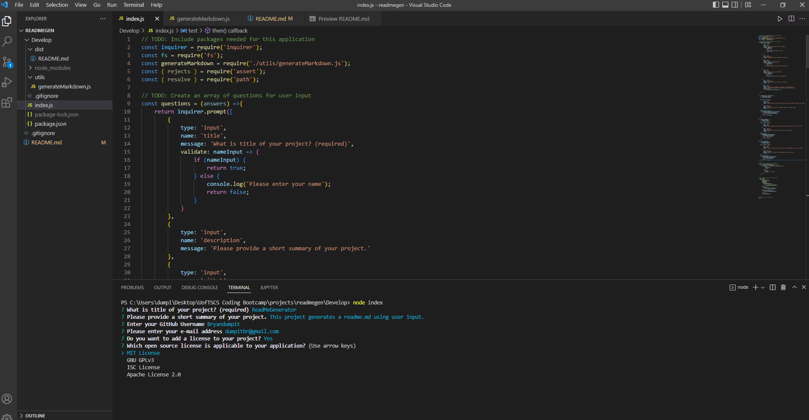

# Professional README Generator 
UofTSCS Coding Bootcamp: Module 09: Readme Generator

## Purpose
An application that generates a professional README.md based on user input regarding their project.

## Built-With
This application was built with:
* Javascript
* Node.js
* Inquirer 8.2.4

## Repository
* [Repository Link](https://github.com/Bryandumpit/readmegen)
* [sample README.md generated](https://github.com/Bryandumpit/readmegen/tree/main/Develop/dist#readme)

## Preview

## Contribution
Made with ❤️ by Bryan Dumpit with help from [How to create a Professional README](https://coding-boot-camp.github.io/full-stack/github/professional-readme-guide) and [Inquirer8.2.4](https://www.npmjs.com/package/inquirer)

## Project Details
* From the starter code provided, inquirer8.2.4 was used to create prompts to collect user input.
* The user input was then used to populate a separate markdown template js file (generateMarkdown.js), the template function was then exported and then imported into index.js
* For license input, an if statement was used to determine whether a license section was rendered into the markdown or omitted. After the user confirms the license, they were given a choice between different licenses. A switch statement was used to render the specified license badge and link from a list of licenses.
* For installation, usage and testing, the user was given a prompt to enter a step and then confirm if there was a next step. The 'when' method was used to loop the prompt until the user confirms there are no further steps. The prompt then moves on to the next step input (from installation to usage to testing).

## User Story
* AS A developer
    * I WANT a README generator
    * SO THAT I can quickly create a professional README for a new project

## Acceptance Criteria
* GIVEN a command-line application that accepts user input
* WHEN I am prompted for information about my application repository
    * THEN a high-quality, professional README.md is generated with the title of my project and sections entitled Description, Table of Contents, Installation, Usage, License, Contributing, Tests, and Questions
* WHEN I enter my project title
    * THEN this is displayed as the title of the README
* WHEN I enter a description, installation instructions, usage information, contribution guidelines, and test instructions
    * THEN this information is added to the sections of the README entitled Description, Installation, Usage, Contributing, and Tests
* WHEN I choose a license for my application from a list of options
    * THEN a badge for that license is added near the top of the README and a notice is added to the section of the README entitled License that explains which license the application is covered under
* WHEN I enter my GitHub username
    * THEN this is added to the section of the README entitled Questions, with a link to my GitHub profile
* WHEN I enter my email address
    * THEN this is added to the section of the README entitled Questions, with instructions on how to reach me with additional questions
* WHEN I click on the links in the Table of Contents
    * THEN I am taken to the corresponding section of the README